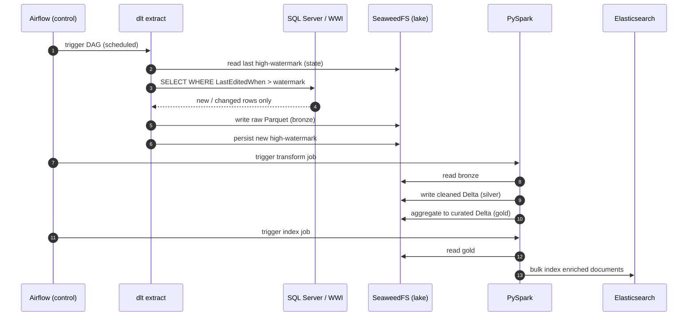
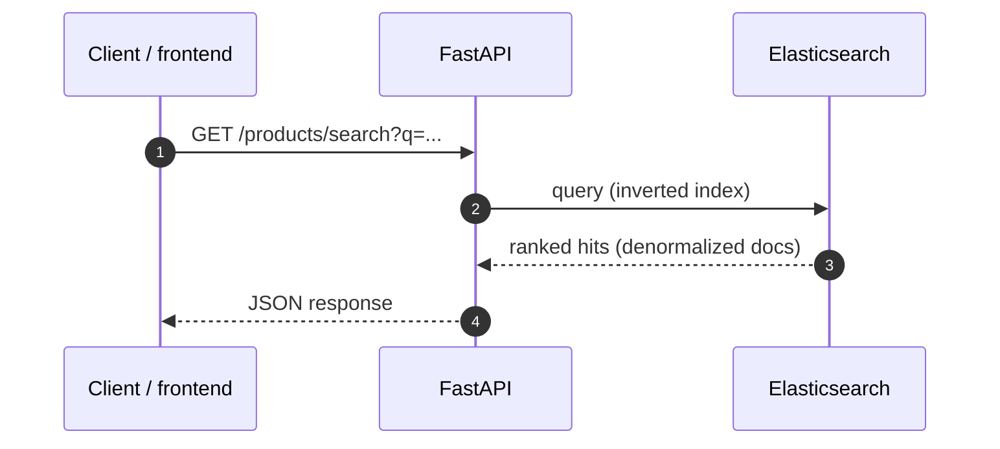
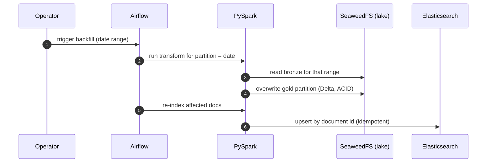

# Architecture

A local data-engineering playground that mirrors an enterprise **Azure** data stack.
Every local component is a deliberate stand-in for an Azure service, so the system
design, data flow, and durable concepts transfer 1:1 when working in the cloud.

The stack is organized into **three planes**:

- **Control plane** — orchestration. Schedules and triggers the batch plane. *(Airflow ↔ Azure Data Factory)*
- **Batch / data plane** — scheduled, bounded jobs that move and shape data, then exit.
- **Serving plane** — always-on, request-driven, low-latency access to curated data.

> A web framework (FastAPI) lives in the **serving plane**, never inside the pipeline DAG.
> Orchestration ("run this graph of jobs on a schedule") and serving ("answer this HTTP
> request now") are different lifecycles.

---

## System design

The full color-coded system diagram lives in a standalone Mermaid file so it stays the single
source of truth (and renders richer in GitHub / Mermaid Live than the inline form):

📊 **[de_playground_system_design_azure.mermaid](de_playground_system_design_azure.mermaid)** —
three-plane flowchart with class-based color coding (control / source / ingest / lake / proc /
serve / api / pandas / consumer / aspirational), the Azure mapping inline on each node, and the
control-plane / data-plane / serving-plane subgraphs.

Line legend: **solid** = data flow · **dashed** = control triggers + pandas edges · **dotted/faded** = aspirational ML.

The four canonical flows (batch ELT, serving request, backfill, CDC) are kept as inline diagrams
below so reviewers see them rendered alongside the prose without leaving the doc.

---

## Local ↔ Azure mapping

| Local (this rig) | Azure (target) | Plane |
|---|---|---|
| SQL Server / WWI | Azure SQL Database / SQL MI | source |
| dlt / pyodbc extract | ADF Copy Activity | batch |
| SeaweedFS | ADLS Gen2 / OneLake | batch |
| Delta tables (bronze/silver/gold) | Delta on ADLS Gen2 / Fabric Lakehouse | batch |
| PySpark cluster | Azure Databricks / Synapse / Fabric Spark | batch |
| Airflow | ADF pipelines + triggers | control |
| Elasticsearch | Azure AI Search / Elastic Cloud on Azure | serving |
| Kibana | Power BI | serving |
| FastAPI | same app on Azure Container Apps / App Service | serving |
| k3d + OpenTofu + Helm + Argo CD + local registry | AKS + Bicep/Terraform + Helm + Flux/Argo + ACR | platform (deploy) |
| PyTorch *(later)* | Azure Machine Learning | aspirational |

---

## Sequence flows

### 1. Scheduled batch ELT run



Key concept: the extract is **idempotent** — re-running pulls nothing new and creates no duplicates because state (the watermark) lives in the lake, not in the job.

### 2. Serving request (read path)



Key concept: the serving plane is **isolated** — FastAPI hits a read-optimized store (Elasticsearch), never the raw lake or the OLTP source. That separation is *why* the API can be fast.

### 3. Backfill / reprocessing



Key concept: **partition overwrite + ACID table format = safe, repeatable reprocessing.** Re-running history doesn't corrupt or double-count.

### 4. CDC change feed (catches deletes; runs alongside the watermark)

```mermaid
sequenceDiagram
    autonumber
    participant SRC as SQL Server (CDC enabled)
    participant EX as dlt CDC extract
    participant LK as SeaweedFS (lake)
    participant SP as PySpark (silver_cdc)

    SRC->>SRC: capture job logs I/U/D into cdc.*_CT
    EX->>SRC: SELECT changes WHERE __$start_lsn > last (hex-LSN watermark)
    SRC-->>EX: change rows (op 1=del,2=ins,3=upd-before,4=upd-after)
    EX->>LK: append change feed (bronze/wwi_cdc)
    SP->>LK: read change feed
    SP->>LK: keep latest per key; DROP keys whose latest op is delete (silver/wwi_cdc)
```

Key concept: the **watermark** sees inserts/edits via `LastEditedWhen` but a delete leaves no
trace; **CDC** reads the transaction-log change tables, so deletes propagate. The two paths
land in separate prefixes (`wwi` vs `wwi_cdc`) so they're directly comparable. CDC needs SQL
Agent and captures from enablement forward — the watermark/full extract is the initial snapshot.

---

## Project structure

```
de-playground/
├── pyproject.toml          # deps + metadata (uv-managed); extras: process/serve/eda/dev
├── uv.lock                 # pinned, committed
├── .env.example            # config template; real .env is gitignored
├── docker-compose.yml      # the stack (SQL Server, SeaweedFS, Spark cluster, ES, Kibana, FastAPI)
├── Makefile                # all workflows: `make help` lists them
├── README.md  CONTRIBUTING.md  CHANGELOG.md  LICENSE
├── docs/  ARCHITECTURE.md  GLOSSARY.md  OBSERVABILITY.md  TROUBLESHOOTING.md  BACKLOG.md  HANDOFF.md
├── dags/wwi_pipeline.py    # Airflow DAG — THIN: orchestrate only, no business logic
├── src/de_playground/      # importable package
│   ├── config.py           # pydantic-settings; connection URLs; least-privilege creds
│   ├── common/             # lake.py (S3 helpers), spark.py (SparkSession), retry.py
│   ├── extract/            # SQL Server -> Bronze: tables, source, pipeline (watermark),
│   │                       #   cdc (Change Data Capture), verify (counts)
│   ├── transform/          # PySpark: silver, silver_cdc, gold, pipeline, inspect_lake
│   └── load/               # to_elasticsearch.py (Gold -> ES)
├── jobs/transform_cluster.py   # spark-submit entry for the standalone cluster
├── api/                    # FastAPI service — own Dockerfile (separate deployable)
├── spark/Dockerfile        # Apache Spark + Delta/S3A jars baked in (cluster + submit image)
├── compose/                # modular compose: core / spark / serving / observability (via include:)
├── platform/               # Phase 5 deploy track: k3d-config, Helm chart (charts/api), OpenTofu
│                           #   (tofu/), Argo CD app (argocd/), Airflow 3 image + chart values
├── kibana/saved_objects.sh # export/import dashboards as version-controlled NDJSON
├── sql/                    # restore, enable_cdc, create_app_login (+ .sh wrappers)
├── tests/                  # DB-free unit tests (config, lake/retry, table specs)
├── notebooks/              # pandas EDA — explicitly OUT of the pipeline path
└── data/                   # local scratch + .bak backups, gitignored
```

> Two change-capture paths land in Bronze: the **watermark** extract (`extract/pipeline.py`,
> `LastEditedWhen` cursor → `bronze/wwi/`) and **CDC** (`extract/cdc.py`, SQL Server change
> tables → `bronze/wwi_cdc/`, captures deletes). Silver has a matching pair (`silver.py`,
> `silver_cdc.py`). Gold builds an **ordered** mart (`fact_sales`) and a **billed** mart
> (`fact_invoices`, with profit). Transforms run **local** (`make transform`) or on the
> **cluster** (`make cluster-transform`) from the same code.

---

## What this rig can and cannot teach

**Transfers (the ~80%):** data flow, ELT patterns, medallion modeling, Spark's
distributed execution model, orchestration design (DAGs, retries, backfills),
serving/denormalization patterns, and the SQL + DataFrame transform paradigms.

**Does NOT transfer (learn on Azure later):** managed identity (Entra ID) & Key Vault,
autoscaling & cost control, governance/lineage (Microsoft Purview), and the real cost of
distributed scale (single-machine Spark hides shuffle pain).

**Partially shown here:** *least privilege* — the pipeline connects to SQL Server as a
SELECT-only `de_extract` login (never `sa`) and to SeaweedFS as a non-admin `app` S3 identity;
`sa`/admin are reserved for explicit setup steps. The *principle* transfers; the *mechanism*
(static keys in `.env` vs. Entra ID + Key Vault + RBAC) is what you'd swap on Azure.

### Deliberate non-goals (local-PoC trade-offs by design)

Decisions kept simple on purpose; the *concepts* still transfer to a production cloud build.

- **Identity:** static credentials in `.env`, not Entra ID + Key Vault + managed identity.
  Least *privilege* is shown; the identity *mechanism* is the Azure-only part.
- **SeaweedFS identity scoping** (the non-admin `app` actions): broad Read/Write/List across
  buckets; could tighten to per-bucket actions if desired.
- **Test coverage:** the Spark transform logic is verified ad hoc in local Spark, not in the
  committed suite (which would require Java/Spark in CI). Unit tests cover the DB-free pieces;
  the 4 pure transform functions are written to be testable when CI grows a `pyspark` marker
  (tracked in `BACKLOG.md`).
- **Scale:** single-machine Spark (local and the toy standalone cluster) teaches the mechanics
  but not real network-shuffle cost. The muscle memory transfers; the performance lesson needs
  real distributed hardware.
- **CDC vs Change Tracking:** chose full CDC for fidelity (before/after images, deletes via
  the transaction log); CT would be lighter (no SQL Agent) but loses the row-level deltas.
- **Compute topology:** Airflow (3, KubernetesExecutor on k3d) runs each pipeline step in its own
  ephemeral task **pod** for simplicity; enterprise Airflow / ADF triggers *external* compute
  (Databricks, Synapse, etc.) — the orchestration *concepts* (DAGs, retries, backfills, pod-per-task)
  transfer; the in-pod execution topology is what you'd swap.
- **Deploy target:** the Phase 5 platform track (k3d + OpenTofu + Helm + Argo CD + a local
  registry) is a *local* stand-in for a managed cloud target (AKS / Fabric / Databricks + ACR);
  it teaches the IaC + GitOps + pull-based-CD mechanics, not real multi-node scale or cloud IAM.
