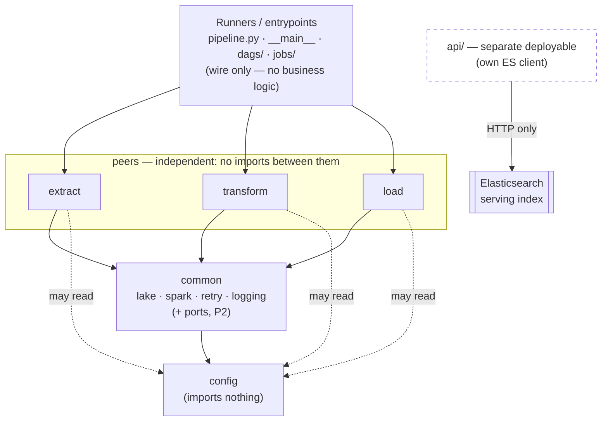
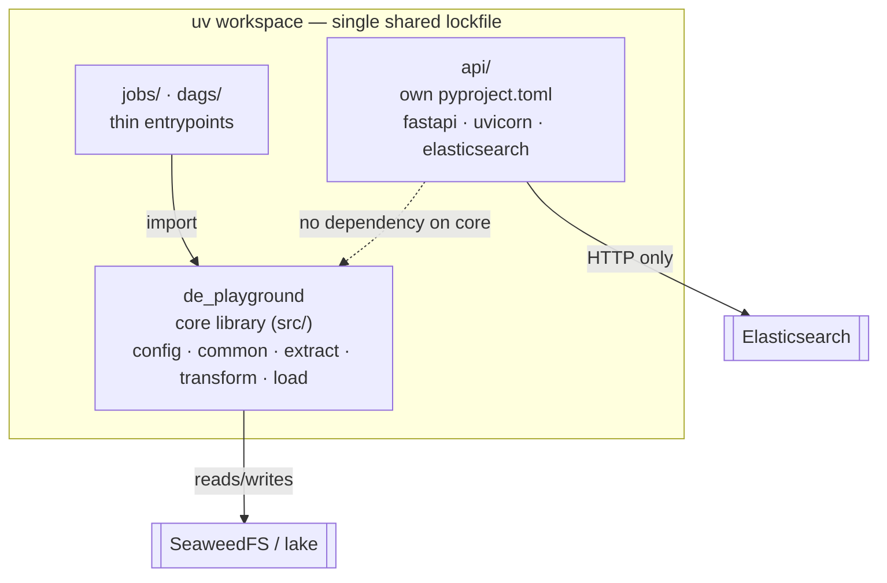
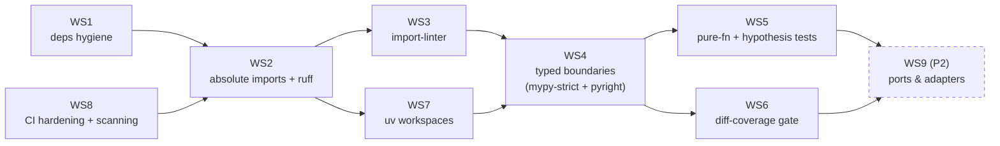

# Python hardening plan

A forward-work plan to make the `de_playground` Python codebase more **robust, maintainable,
tested, and modular with clear contract boundaries** — without gold-plating a working PoC.
Complements [`BACKLOG.md`](BACKLOG.md) (this expands P2's "Spark unit tests", "ADRs", and the
modularity/testing themes into an executable sequence). Reference history in
[`../CHANGELOG.md`](../CHANGELOG.md); design constraints by intent in
[`ARCHITECTURE.md`](ARCHITECTURE.md) ("Deliberate non-goals").

> **Status: COMPLETE 2026-06-11 — P1 series landed in 14 commits (1 doc precursor + 1 lint
> fix + 1 oracle target + 1 hang fix + 8 workstreams + 1 final-acceptance target).** See
> `CHANGELOG.md` `[Unreleased]` for the rolling diff; full cold-rebuild final acceptance
> passes "diff modulo timestamps/load-ids" (see "Validation & regression safety"). P2
> (WS9 Ports & adapters) remains queued.
>
> **Status: APPROVED 2026-06-10 — ready for implementation handoff.** All scope questions are
> resolved (see "Decisions log"); the "Codebase map" anchors each workstream to concrete files;
> "Validation & regression safety" defines how to prove no behavior changed.
> Decisions taken with the maintainer:
> **(1)** phased — enforcement + typed boundaries now (P1), Protocol ports + adapters planned
> (P2), full per-layer package split deferred (P3); **(2)** adopt absolute imports + `ruff`
> TID252; **(3)** `mypy --strict` (CI gate) + `pyright` (staged: editor-strict, CI escalates
> last); **(4)** gate **diff/patch coverage** at 80% of changed lines, report total; **(5)**
> restructure to **uv workspaces**, promoting `api/` (not `jobs/`) to a first-class package;
> **(6)** add **supply-chain + secrets scanning + GitHub-Actions hardening**. Implementation lands
> as a series of focused commits (one per workstream); each commit updates the docs it touches.

---

## Before you start (prerequisites & ground rules)

Read this section first — it's the operational spine; everything after it is detail. **How to
read the rest:** why (Goals) → what's wrong (Current-state assessment) → target (Target shape) →
the work (Workstreams) → order (Sequencing) → proof (Validation) → records (Decisions / Docs).

**Prerequisites — gates, do not skip:**

1. **Stand up the full local stack.** This refactor is validated against the *live* rig, not just
   a checkout — CI is DB-free by design, so behavior can only be proven against running services.
   You need Docker, JDK 17 (Spark), ODBC Driver 18, `uv`, Python 3.11, then `make sync-all`,
   `make up-all`, and the databases restored. Setup lives in [`README.md`](../README.md) /
   [`CONTRIBUTING.md`](../CONTRIBUTING.md) — follow it, don't reinvent it.
2. **Capture the golden baseline BEFORE the first code change — this is Gate 0.** It can only be
   taken on unmodified `main` against a fully-run pipeline; lose it and you've lost the regression
   oracle the whole plan depends on. Procedure: "Validation & regression safety → Gate 0".

**Ground rules — know these up front:**

- **Workstream numbers are stable IDs, *not* execution order.** Follow the dependency DAG in
  "Sequencing, risk, and CI": WS1 + WS8 land first, *then* WS2, and so on (WS8 deliberately
  front-loads). Don't implement in numeric order.
- **One focused commit per workstream** (or per sub-step where noted), and the *same* commit
  updates any doc it falsifies plus a `CHANGELOG` entry (see "Documentation upkeep"). The clean
  history is part of the deliverable.
- **Prime directive: preserve behavior.** Only **WS4** intentionally changes runtime behavior;
  every other commit must diff clean against the Gate-0 baseline. Always know which bucket your
  commit is in (table in "Validation & regression safety").
- **Don't undo deliberate decisions.** The repo's non-goals are intentional, not gaps — e.g. no
  create-if-missing bucket logic, no secrets vault, Spark intentionally can't run in default CI,
  and dlt's snake_case column names are a hard contract (Pydantic models in WS4 must match them).
  Skim [`ARCHITECTURE.md`](ARCHITECTURE.md) "Deliberate non-goals" + [`AGENTS.md`](../AGENTS.md)
  "Operational conventions" before "fixing" anything that looks off.
- **When something breaks, check [`TROUBLESHOOTING.md`](TROUBLESHOOTING.md) first** — the env
  races, JDK/Apple-Silicon, and service-readiness gotchas are already catalogued there.

---

## Goals, non-goals, anti-goals

Separating these keeps the work honest and prevents scope creep into the "20% that doesn't
transfer" the architecture doc already calls out.

**Goals**

- **Type safety *at the contract boundaries*** — the dict-typed seams where data crosses into
  Elasticsearch, the API, and out of dlt. Not inside the Spark transforms (DataFrames are
  structurally untyped; forcing types there is noise).
- **Architecture enforced by CI, not vigilance** — the layering that today lives in
  `CONTRIBUTING.md` prose becomes machine-checked import contracts.
- **Each layer/module has one responsibility and a clear contract**, so a dependency can be
  swapped (SeaweedFS → ADLS, Elasticsearch → Azure AI Search) by editing one adapter.
- **Testable pure logic actually tested** — the functions written to be pure but currently
  uncovered.
- **Polyrepo-extraction-ready** — module seams clean enough that `extract/`, `transform/`,
  `load/`, or `common/` could become its own package with minimal surgery.

**Non-goals (deliberately out of scope here)**

- **Secrets vault / managed identity** — stays an Azure-only lesson per
  `ARCHITECTURE.md` non-goals. Config keeps reading `.env`; we only improve *how* it's injected.
- **Restructuring the medallion data model** — Bronze/Silver/Gold semantics are correct and
  stay as-is.
- **Real distributed-scale Spark tuning** — single-machine limitation is acknowledged; not a
  Python-hardening concern.
- **Rewriting working orchestration / platform (Phase 5)** — DAG, Helm, OpenTofu untouched.

**Anti-goals (things this plan must *not* cause)**

- **Don't add abstraction without a second implementation in sight.** Ports/adapters (P2) are
  justified by the explicit Azure-swap goal; we will *not* wrap things that will only ever have
  one backend.
- **Don't chase 100% mypy-strict purity** through the untyped Spark/dlt internals — the 2026
  consensus is that produces overwhelming noise. Scope strictness to where it catches real bugs.
- **Don't mock-pad the test suite.** Mock-heavy tests are a symptom of missing boundaries; the
  P2 ports exist precisely so tests use in-memory fakes, not patch-the-world mocks.

---

## Current-state assessment (evidence-based)

The codebase is genuinely good — `src` layout, `pyproject` single-source, `uv` + lockfile,
thin runners + pure functions, structured logging, `ruff` bugbear (`B`) already guarding the
mutable-default / `B008` anti-patterns from the brief. The gaps below are the delta to
"hardened", each tied to a file so it's verifiable, not hand-waved.

| # | Finding | Evidence | Severity |
|---|---|---|---|
| 1 | **Spurious dependencies** in the *main* dependency set, imported nowhere. `operators` is an unrelated PyPI package (supply-chain smell); `psutil` is unused. | `pyproject.toml:18` (`psutil`), `:19` (`operators`); `grep` finds zero imports in `src/api/jobs/dags` | **High** (supply chain) |
| 2 | **Layering is convention-only** — nothing stops `common/` importing `transform/`, or `extract/` reaching into `load/`. The "dependencies flow toward contracts" rule isn't enforced. | No `import-linter`; CI runs only ruff+mypy+pytest (`.github/workflows/ci.yml`) | **High** |
| 3 | **Untyped `dict` boundaries** — the exact "type at the seam" target. Documents into ES, API request/response, and dlt rows are bare `dict`. | `load/to_elasticsearch.py:59` (`-> list[dict]`), `:67`; `api/main.py:29` (`build_query -> dict`), `:57`; `transform/inspect_lake.py` reports | **High** |
| 4 | **No Protocol seams / DI** — modules reach the global `settings` singleton and `new` up boto3 / `Elasticsearch` directly; the "lake", "search index", "source" are concrete, not abstractions. | `config.py:65` (`settings = Settings()`); `lake.py:33`; `load/to_elasticsearch.py:78`; `api/main.py:26` | **Medium** (P2) |
| 5 | **Relative imports everywhere** — 28 `from ..` / `from .` sites; complicates module moves and polyrepo splits. | `grep "from \.\." src` → 28 | **Medium** |
| 6 | **Brittle exception handling** — control flow on exception *message* string-matching; two broad `except Exception`. | `transform/silver_cdc.py:53` (`"PATH_NOT_FOUND" in str(err)`); `verify.py:79`; `api/main.py:46` | **Medium** |
| 7 | **Pure functions untested** — `build_query`, `to_actions`, `verify._build_report` need no Spark yet have no tests; the 4 Spark transforms remain ad-hoc (known, in BACKLOG P2). | `tests/` covers only specs + lake/retry | **Medium** |
| 8 | **mypy non-strict; `boto3-stubs` paid for, unused** — helpers like `s3_client` have no return type, so the stub package buys nothing. | `pyproject.toml:58-66`; `lake.py:20` (`def s3_client(admin=False):`) | **Medium** |
| 9 | **Duplicated/implicit contract** — index name `"fact_sales"` and the document shape are redeclared independently by producer and consumer. | `load/to_elasticsearch.py:27` vs `api/main.py:23`; mapping at `load:31` | **Low** |
| 10 | **No `__all__` / `py.typed`** — package public surface is implicit; the cluster job importing `de_playground` gets no type info. | empty `__init__.py` files; no `py.typed` | **Low** |
| 11 | **`api/` has no `pyproject.toml`** — its deps are declared twice and can drift: in the `serve` extra and hardcoded in the Dockerfile. | `pyproject.toml:28-32` (`serve`) vs `api/Dockerfile` (`fastapi`/`uvicorn`/`elasticsearch` pinned inline) | **Medium** |
| 12 | **No dependency / supply-chain scanning** — no Dependabot, no `pip-audit` (known-vuln deps), no `ruff S`/bandit (insecure code patterns). Finding 1 slipped in precisely because nothing watches deps. | `.github/` has only `workflows/ci.yml`; ruff `select` lacks `S` (`pyproject.toml:56`) | **Medium** |
| 13 | **CI not hardened** — actions pinned to mutable tags (`@v4`/`@v5`), no least-privilege `permissions:` block; the current GitHub-recommended baseline. | `.github/workflows/ci.yml` (`actions/checkout@v4`, `astral-sh/setup-uv@v5`; no `permissions:`) | **Medium** |
| 14 | **No secrets scanning** despite `.env` + least-privilege creds in the repo flow. | no gitleaks/detect-secrets in `.pre-commit-config.yaml` or CI | **Medium** |
| 15 | **`.idea/` is gitignored but 6 files are already tracked** (committed before the ignore rule landed). | `git ls-files` → `.idea/*.xml`, `.idea/de-playground.iml`; `.gitignore` lists `.idea/` | **Low** |
| 16 | **No CI coverage signal** — `pytest` runs but coverage is neither measured nor gated, so test-debt regressions are invisible. | `.github/workflows/ci.yml` (`pytest`, no `--cov`); `pytest-cov` absent (BACKLOG P2) | **Low** |

---

## Target shape

### Layered import contract (enforced)

Arrows = "imports / depends on"; dependencies flow **downward, toward the contracts**.

- **`common` may not import `extract`/`transform`/`load`** (forbidden contract).
- **`extract`, `transform`, `load` are independent** of each other (independence contract).
- **Runners sit on top** and may import any layer (layers contract, high→low only).
- **`api/` is a separate deployable** and must not import the pipeline package at all
  (forbidden/independence) — it talks to ES through its own typed client, preserving the
  serving-plane isolation the architecture already mandates.

### Two-phase delivery

- **P1 — Enforce + type + harden (this cycle).** Dependency hygiene, absolute imports + ruff
  rules, `import-linter` contracts, Pydantic models at the ES/API boundaries, mypy-strict
  (scoped) + pyright, cheap pure-function tests **with a diff-coverage gate**, **supply-chain +
  secrets scanning + CI hardening**, and a **uv-workspaces** restructure that promotes the
  deployables (`api/`, optionally `jobs/`) to first-class packages. Mostly additive; the one
  structural change (workspaces) is low-risk because the deployables' deps are already separate.
- **P2 — Ports + adapters (planned, sequenced after P1 lands).** Introduce `Protocol` ports and
  concrete adapters + constructor injection, so the Azure swaps become one-file changes and the
  test suite drops mocks for in-memory fakes.
- **P3 — Full per-layer package split (deferred; trigger-gated).** Only if a layer needs to be
  versioned, released, or scaled independently. Tracked in [`BACKLOG.md`](BACKLOG.md) (P5).

### Target package layout (after WS7)

The uv-workspace shape P1 lands — one lockfile, the core library plus the promoted deployables.
`api/` deliberately has **no** dependency on the core package (serving-plane isolation); `jobs/`
imports it. Each member is then a `git mv` away from its own repo if P3 is ever triggered.

---

## P1 workstreams

### WS1 — Dependency hygiene *(do first; isolated, zero behavioral risk)* ✅ landed 2026-06-11

1. Remove `operators>=1.0.1` and `psutil>=7.2.2` from `pyproject.toml` `dependencies`
   (Finding 1). Re-lock (`uv lock`) and run the suite. If anything *does* use `psutil` later,
   re-add it intentionally to the right extra.
2. Either *use* `boto3-stubs` (add return types via `mypy_boto3_s3.S3Client`, Finding 8) or
   drop it. Recommendation: **keep and use it** — it's the cheapest typed-boundary win on the
   lake helpers.
3. Audit the remaining deps for "in `dependencies` but only needed by one phase" and move to the
   matching extra (keeps `uv sync` honest).

**Exit:** clean dependency tree, suite green, `uv lock` committed.

### WS2 — Imports: absolute + ruff rule expansion ✅ landed 2026-06-11

1. Convert all 28 relative-import sites in `src/` to absolute (`from de_playground.common.lake
   import s3a`). Mechanical; `ruff --fix` won't do it, but it's a contained find-replace per
   module.
2. Enable in `[tool.ruff.lint.flake8-tidy-imports]`: `ban-relative-imports = "all"` (TID252).
3. Expand `[tool.ruff.lint] select` beyond `E,F,I,UP,B` with high-signal sets:
   `TID` (tidy-imports), `RUF`, `SIM` (simplify), `PTH` (pathlib-over-os.path — the brief's
   `pathlib` point), `PT` (pytest style), `LOG`/`G` (logging correctness), and `RET`/`C4`.
   Stage these — add, autofix, review — rather than enabling all at once.
4. Use `banned-api` (TID251) for *specific* symbol bans where it fits (e.g. ban bare `print`
   so structured logging isn't bypassed; ban dialect-specific SQLAlchemy types). **Note:** ruff
   cannot express *per-layer cross-module* bans well — those belong to `import-linter` (WS3),
   not ruff. This division of labor is deliberate.

**Exit:** `ruff check` green with the expanded set; TID252 enforced.

### WS3 — Architecture enforcement with `import-linter` ✅ landed 2026-06-11

`import-linter` (current 2.x) reads contracts from `pyproject.toml`/`.importlinter` and runs as
a CI step (`lint-imports`). Three contract types cover the target shape:

- **Layers contract** — declare `common < {extract, transform, load} < runners` with `config`
  at the base. Higher may import lower, never the reverse.
- **Independence contract** — `extract`, `transform`, `load` must not import one another.
- **Forbidden contract** — `de_playground.common` is forbidden from importing
  `extract`/`transform`/`load`; `api` is forbidden from importing `de_playground` at all.

Add `lint-imports` to `.github/workflows/ci.yml` and to pre-commit. **Start with the layers
contract `exhaustive` ON** — the package is small enough (5 sub-packages, ~15 modules) to map
completely today, and exhaustive mode then *forces* every new module to be placed in the layer
graph deliberately, catching architectural drift the moment it's introduced rather than later.
The only "cost" — adding each new module to the contract — is the feature, not a burden, for a
maintainer who wants the architecture enforced by CI. (Reserve non-exhaustive for large legacy
codebases where a full map isn't feasible up front.)

**Exit:** `lint-imports` passes and is a required CI check; a deliberately-wrong import (e.g.
`common` importing `transform`) fails it locally.

### WS4 — Typed contract boundaries (Pydantic + mypy-strict + pyright) ✅ landed 2026-06-11 (commits 6a/6b/6c)

This is the heart of "type safety at the contract boundaries." The Spark transforms keep
returning `DataFrame`; we type the *edges* where structure is knowable.

1. **Pydantic models for the cross-boundary records.** Define the Gold→ES document and the API
   response/query as Pydantic models (a shared `FactSalesDoc`, `SalesSearchResult`,
   `SalesSearchQuery`). This:
   - kills the duplicated implicit contract (Finding 9) — the index name + document shape live
     once;
   - makes `to_actions` / `build_query` / the endpoints return typed objects, not `dict`;
   - FastAPI gets real response models (automatic schema + validation) for free.
2. **Config injection seam.** Replace the import-time `settings = Settings()` singleton
   (`config.py:65`) with a cached `get_settings()` factory (`@lru_cache`). Same ergonomics, but
   tests can override and nothing runs at import. (Full DI is P2; this is the compatible first
   step.)
3. **Typed lake helpers.** Annotate `s3_client`/`pyarrow_s3` returns using `boto3-stubs`
   (`mypy_boto3_s3`), turning Finding 8's unused dependency into enforcement.
4. **mypy strict, scoped.** Set `strict = true`, then add `[[tool.mypy.overrides]]` that relax
   `disallow_untyped_defs`/`disallow_any_*` for the modules that touch opaque Spark/dlt types
   (`transform.*`, the dlt resource builders in `extract.source`/`extract.cdc`). This keeps the
   existing pragmatic philosophy (`pyproject.toml:58-66`) but inverts the default to strict.
5. **pyright as a second gate — staged, not strict-from-day-one.** Two maximally-strict checkers
   isn't double the safety; it's reconciling tool disagreements, most of it noise about *untyped
   libraries* (PySpark/dlt/pyarrow) rather than our code. So stage it:
   1. Land step 4 first — get `mypy --strict` green on the boundaries (it does ~90% of the cleanup).
   2. Add `[tool.pyright]` at `typeCheckingMode = "standard"` as the CI gate, and run **pyright
      strict in the editor only** (advisory) for live-feedback QoL that *guides* cleanup without
      blocking merges.
   3. Escalate CI pyright to `strict` only once the boundaries are typed and the residual delta
      over mypy is small and mostly genuine. (Skipping the staging just forces broad Spark-module
      suppressions anyway — "strict everywhere" collapses into "strict at the boundaries", so
      scope it deliberately.) mypy-strict remains the unforgiving merge gate throughout.
   > **Type-checker choice:** stay on **mypy + pyright**; **`ty` deferred** — as of mid-2026 it's
   > beta (`0.0.x`, no stable API) and its first-class Pydantic support (which this workstream
   > leans on) is still pre-stable. Revisit at its stable release; developers may run it locally
   > for speed in the meantime.
6. **Exception precision** (Finding 6): replace the `"PATH_NOT_FOUND" in str(err)` string-match
   in `silver_cdc.py:53` with a real path-existence check before read (or a typed sentinel),
   and narrow the two broad `except Exception` to the specific failure where practical.
7. Add `py.typed` + minimal `__all__` to packages so the typed surface ships (Finding 10).

**Exit:** `mypy --strict src` green and the CI gate; pyright (standard) green; pyright-strict
escalation tracked for after boundaries are typed; no bare `dict` on a public boundary in
`load`/`api`.

### WS5 — Testing the pure logic ✅ landed 2026-06-11

The brief's testing line: *pytest fixtures/parametrize, hypothesis for properties; mock-heavy
suites signal missing boundaries.* Apply incrementally.

1. **No-Spark pure functions first** (fast, no Java): `api.build_query` (parametrize the
   filter-combination matrix), `load.to_actions` (date coercion + id keying),
   `verify._build_report` (OK/APPEND/DIFF status logic). These are pure and currently uncovered
   (Finding 7).
2. **Hypothesis property tests** where invariants are clear — e.g. `to_actions` preserves row
   count and always emits a valid `_id`; `build_query` always yields a structurally valid ES
   bool query for any filter combination.
3. **Spark transforms behind a marker** — implement BACKLOG P2's `tests/test_transforms_spark.py`
   for `build_fact_sales`, `build_fact_invoices`, `silver.conform`, `silver_cdc.collapse_changes`
   using a local `SparkSession` fixture, gated by a `pyspark` pytest marker so default CI stays
   Java-free and an opt-in job runs them. Add `pytest-cov` (BACKLOG P2) to report coverage.
4. Adopt `pytest` idioms via ruff `PT`; keep fixtures over `unittest`.

**Exit:** pure-function coverage in CI; Spark tests runnable under the marker; coverage reported.

### WS6 — CI coverage gate (diff coverage, not a vanity threshold) ✅ landed 2026-06-11

Decision: **gate the diff, report the total.** A hard global `--cov-fail-under=85` would be
coverage theater here — you're starting from low coverage and the Spark suite can't run in the
default (Java-free) CI job, so the absolute number is structurally misleading. The 2026
consensus for exactly this situation is patch/diff coverage.

1. Add `pytest-cov` to the `dev` extra; CI runs `pytest --cov=de_playground --cov-report=xml`.
2. Add **`diff-cover`** as a CI step: `diff-cover coverage.xml --compare-branch=origin/main
   --fail-under=80` so each change must cover **80% of its own new/changed lines** (the diff
   against `main`), independent of legacy gaps. This rewards small, well-tested commits without a
   flag-day backfill. (80% applies only to changed lines, so it's strict-but-achievable; raise
   later if it never bites.)
3. Report total coverage (CI artifact or summary) for visibility — **do not** block on it.
4. Scope measurement to code the default job can actually execute: omit the Spark-marked modules
   from the default `--cov` (they're measured only in the opt-in `pyspark` job) via
   `[tool.coverage.run] omit`, so their unrun lines don't drag the number into nonsense.

**Exit:** CI fails when a change adds uncovered lines; total coverage is visible but non-blocking;
Spark code is excluded from the default measurement, not faked.

### WS7 — Monorepo shape: uv workspaces, promote the deployables ✅ landed 2026-06-11

Today the repo is a single package (`src/de_playground`) plus loose service dirs (`api/`,
`jobs/`, `dags/`). The 2026 real-world monorepo shape is a **uv workspace**: multiple
`pyproject.toml` members sharing one lockfile, referencing each other from source. This is the
structural seam that makes a future polyrepo split cheap — the explicit long-term goal.

1. Add `[tool.uv.workspace]` with `members = [...]` to the root `pyproject.toml`. Keep
   `de_playground` (the `src/` package) as the **core library** member.
2. **Promote `api/` to a workspace member** with its own `pyproject.toml` (deps: `fastapi`,
   `uvicorn[standard]`, `elasticsearch`, the OTel pieces). This kills Finding 11 — deps stop
   living in both the `serve` extra and `api/Dockerfile`; the Dockerfile installs the package
   instead. `api` declares **no** dependency on `de_playground`, preserving the serving-plane
   isolation the import contracts already enforce (WS3).
3. **Do *not* promote `jobs/`** — keep it importing the core package. `jobs/transform_cluster.py`
   is a ~40-line spark-submit driver whose entire dependency set *is* `de_playground[process]`; it
   has no distinct deps, so a separate `pyproject.toml` is packaging ceremony for zero boundary
   gain (the import contract already governs it). `dags/` likewise stays thin (it shells out via
   `BashOperator`, importing only Airflow). Revisit only if `jobs/` grows a dep the core lib
   shouldn't carry.
4. Single shared lockfile is the constraint: this works *because* the current extras already
   resolve together. The one genuine conflict (Airflow vs. the pipeline venv) stays solved by
   separate venvs/images, **not** by the workspace — call this out so no one expects workspaces
   to isolate conflicting versions.
5. Sequence **after WS2** (absolute imports) — workspace members importing the core package read
   cleanly as `from de_playground...` with no relative-path surprises across member boundaries.

**Exit:** `uv sync` resolves the workspace; `api` builds from its own `pyproject` (no duplicated
deps); each member could be `git mv`'d to its own repo with only a path change.

### WS8 — Supply-chain, secrets, and CI hardening ✅ landed 2026-06-11

The three hardening tracks selected. All additive CI/pre-commit gates; no runtime change.

1. **Dependency + code scanning** (Findings 1, 12):
   - **Dependabot** (`.github/dependabot.yml`) for `pip`/`uv` *and* `github-actions` ecosystems —
     so spurious/vulnerable deps and stale actions surface as PRs automatically.
   - **`pip-audit`** as a CI job against the locked environment (known-CVE deps).
   - **`ruff` `S` ruleset** (flake8-bandit) added to `select` — catches insecure code patterns
     (hardcoded passwords, unsafe calls) in-tree, one tool, no separate bandit install. Add a
     per-file-ignore for `S101` (asserts) under `tests/`.
2. **Secrets scanning** (Finding 14): **gitleaks** (or detect-secrets) as a pre-commit hook
   *and* a CI job, so a real credential can't be committed even though `.env` is ignored. Seed a
   baseline so the known LOCAL-ONLY placeholders in `.env.example` don't trip it.
3. **GitHub Actions hardening** (Finding 13):
   - **Pin actions to full commit SHAs** (not `@v4`) — immutable, and Dependabot bumps them.
   - Add a least-privilege top-level **`permissions: { contents: read }`** block, widening
     per-job only where needed.
4. **Untrack the committed `.idea/` files** (Finding 15): `git rm -r --cached .idea` — they're
   already in `.gitignore`, they just predate it.

**Exit:** Dependabot open; `pip-audit` + `ruff S` + gitleaks green in CI and pre-commit; actions
SHA-pinned with a `permissions` block; `.idea/` no longer tracked.

---

## P2 workstream (planned — after P1)

### WS9 — Ports & adapters + dependency injection

Justified by the explicit swap goals (SeaweedFS→ADLS, ES→Azure AI Search). Shape:

- **Ports** (`de_playground/ports.py`, `typing.Protocol`, structural — duck-typed like TS
  interfaces, per the brief): e.g. `ObjectStore` (exists/create/path), `SearchIndex`
  (recreate/bulk_load/search), `SourceReader` (incremental table reads). Ports live in/near
  `common`; imports point *toward* these abstractions.
- **Adapters** (`de_playground/adapters/`): `seaweedfs.py`, `elasticsearch.py`, `sqlserver.py`
  implement the ports. Concrete details (boto3, the ES client, pyodbc) sit at the edges.
- **Injection at one wiring point.** Runners construct the adapter and pass it in; pure logic
  depends only on the Protocol. The Azure swap becomes "write `adls.py` implementing
  `ObjectStore`, wire it in one place."
- **Tests drop mocks** for in-memory fakes (`InMemoryObjectStore`, `FakeSearchIndex`) that
  satisfy the Protocol — directly addressing the "mock-heavy = missing boundaries" point.
- **Polyrepo dividend:** once each layer depends only on ports, lifting `extract/` or `load/`
  into its own repo means shipping the port package + that layer — the seam already exists.

This is a larger change; it ships only after P1's contracts/types make the refactor safe and
reviewable. Capture each port boundary as an ADR (BACKLOG P2 "ADRs") when introduced.

---

## Codebase map (for the implementer)

Concrete entry points so a developer can pick this up without prior context. **Read first:**
[`AGENTS.md`](../AGENTS.md) (where code lives), [`CONTRIBUTING.md`](../CONTRIBUTING.md)
(conventions + how-to-extend), [`docs/ARCHITECTURE.md`](ARCHITECTURE.md) (planes + structure),
then the "Current-state assessment" table above (every finding is file:line-anchored). Each
workstream's touch-set:

| WS | Edits | New files |
|---|---|---|
| WS1 deps hygiene | `pyproject.toml` (drop `operators`/`psutil`; use or remove `boto3-stubs`), re-`uv lock` | — |
| WS2 imports + ruff | all 28 relative-import sites in `src/de_playground/**`; `pyproject.toml` (`[tool.ruff.lint] select` += `TID,RUF,SIM,PTH,PT,LOG,G,RET,C4`; `[tool.ruff.lint.flake8-tidy-imports] ban-relative-imports="all"`) | — |
| WS3 import-linter | `pyproject.toml` (`[tool.importlinter]` contracts), `.github/workflows/ci.yml`, `.pre-commit-config.yaml` | `.importlinter` (or inline) |
| WS4 typed boundaries | `load/to_elasticsearch.py`, `api/main.py`, `config.py` (`get_settings()`), `common/lake.py` (typed returns), `transform/silver_cdc.py` (exception precision), `extract/verify.py`; `pyproject.toml` (mypy `strict`+overrides, `[tool.pyright]`) | `src/de_playground/contracts.py` (Pydantic models), `src/de_playground/py.typed` |
| WS5 tests | `pyproject.toml` (`dev` += `hypothesis`,`pytest-cov`; `[tool.pytest.ini_options] markers`) | `tests/test_api.py`, `tests/test_load.py`, `tests/test_verify.py`, `tests/test_transforms_spark.py` (marker), `tests/conftest.py` (spark fixture) |
| WS6 coverage gate | `.github/workflows/ci.yml` (`pytest --cov` + `diff-cover` step), `pyproject.toml` (`[tool.coverage.run] omit`) | — |
| WS7 uv workspaces | root `pyproject.toml` (`[tool.uv.workspace] members`), `api/Dockerfile` (install pkg, drop inline pins) | `api/pyproject.toml` |
| WS8 hardening | `.github/workflows/ci.yml` (SHA-pin actions, `permissions:`, `pip-audit`+`gitleaks` jobs), `.pre-commit-config.yaml` (gitleaks); `git rm -r --cached .idea` | `.github/dependabot.yml`, `.gitleaks.toml` (baseline) |
| WS9 ports/adapters (P2) | runners in `extract/transform/load/pipeline.py` (inject), `common/` | `src/de_playground/ports.py`, `src/de_playground/adapters/{seaweedfs,elasticsearch,sqlserver}.py` |

> File/line anchors for *why* each change is needed live in the assessment table (Findings 1–16);
> the existing runtime data-flow diagram is
> [`docs/de_playground_system_design_azure.mermaid`](de_playground_system_design_azure.mermaid) —
> this plan deliberately doesn't duplicate it (that's *runtime*; these diagrams are *code
> structure*).

---

## Sequencing, risk, and CI

This work lands together as one cohesive effort, but as a **series of focused commits — one per
workstream (or per sub-step where noted)** — so the revision history reads cleanly and any single
change can be reverted or bisected on its own. Order is chosen so each commit is independently
reviewable and the cheap/safe wins land first. Edges below = "must land before":

The ordered rationale:

1. **WS1 dependency hygiene** — isolated, reversible, immediate supply-chain win.
2. **WS8 CI hardening + scanning** — pull this early alongside WS1; it's additive and would have
   caught Finding 1. (Listed as WS8 for grouping, but front-load it.)
3. **WS2 imports + ruff** — mechanical; large diff but behavior-preserving; autofixable parts
   reviewed in isolation. (Adds the `S` ruleset from WS8.)
4. **WS3 import-linter** — additive CI gate; no runtime change.
5. **WS7 uv workspaces** — after WS2 so cross-member imports are absolute; promotes `api/` first.
6. **WS4 typed boundaries** — the substantive change; commit per-boundary (ES doc, then API, then
   config seam) so each commit is small and self-contained.
7. **WS5 tests** + **WS6 diff-coverage gate** — interleave with WS4 (tests prove the typed
   boundaries; the gate lands once `pytest-cov` is in).
8. **WS9 ports/adapters (P2)** — separate epic, ADR-per-port.

**CI evolution** (`.github/workflows/ci.yml`): add `lint-imports`, `pyright`, `mypy --strict`
(replacing the current non-strict `mypy src`), `pip-audit`, `gitleaks`, and the `diff-cover`
step; fold the `ruff S` ruleset into the existing `ruff check`. Keep `ruff format --check` +
`pytest`. Harden the workflow itself — SHA-pinned actions + a least-privilege `permissions:`
block. Mirror the new gates in `.pre-commit-config.yaml` (ruff already there; add gitleaks +
`lint-imports`). Add Dependabot for `pip`/`uv` + `github-actions`. Consider BACKLOG P5's uv/ruff
caching to offset the extra steps.

**Risk register**

- *Absolute-import churn (WS2)* touches every module — land it as one focused commit, no logic
  changes, suite green before/after.
- *uv-workspace lockfile (WS7)* — a single shared lock means a future member with a conflicting
  dep version breaks resolution; the mitigation is the existing separate-venv pattern for such
  cases, not the workspace. Don't promote a member whose deps genuinely conflict.
- *mypy-strict noise (WS4)* — mitigated by scoped overrides; if a module is still all-noise,
  relax it explicitly with a comment rather than weakening the global setting.
- *Spark test flakiness (WS5)* — isolate behind the marker so it never blocks the default gate.
- *Scanner false positives (WS8)* — seed gitleaks/`pip-audit` baselines (the `.env.example`
  placeholders, any unfixable transitive CVE) so the gate stays trustworthy, not noisy.
- *Over-abstraction (WS9)* — guarded by the anti-goal: a port needs a credible second backend
  before it's introduced.

---

## Validation & regression safety

This is **working, locally-smoke-tested code**. Almost every workstream is behavior-*preserving*
by design, so validation's job is to *prove* the outputs are unchanged — not to invent new
behavior. The repo already ships the oracle: `make counts`, `make inspect`, and the API/Kibana
checks in `README.md`. The protocol is: **capture a golden baseline once, diff against it after
each commit, and run a full end-to-end acceptance after the series.**

### Gate 0 (prerequisite) — capture the golden baseline

**Blocking: must run on unmodified `main`, before the first commit of the series.** It can't be
reconstructed once code changes, and the entire per-commit gate diffs against it. Against the live
stack (`make up-all`, databases restored, pipeline run once), capture and save to a scratch dir
(gitignored) the current observable behavior:

- `make counts` — source-vs-Bronze row counts per table.
- `make inspect LAYER=bronze`, `… silver`, `… gold` **with `--json`** — row counts, column
  counts, Delta versions, partition columns, and sample rows for every table.
- ES: `GET fact_sales/_count` + the three canonical `README` queries
  (`/sales/search?q=USB&limit=5`, `?customer_id=1&min_total=100`, `/sales/501`) → save the JSON.
- Tool baseline: `ruff check`, `mypy src`, `pytest` results as they stand today.

These JSON snapshots are the regression oracle. Nothing in P1 should change them (WS4 is the one
exception to scrutinize — see below).

### Per-commit gate — matched to what the commit can change

| Commit type | Workstreams | Bar to clear |
|---|---|---|
| **Behavior-preserving refactor** | WS1, WS2, WS7 | CI green (ruff/mypy/pytest); package still imports (`python -c "import de_playground.extract, …"`); `make extract && make transform && make index` produce **identical** `make counts` / `inspect --json` / ES snapshots vs baseline (byte-diff the JSON). |
| **Additive gate, no runtime change** | WS3, WS5, WS6, WS8 | The new check passes *and* is proven to bite (introduce a deliberate violation, confirm red, revert). Existing suite + golden snapshots unchanged. |
| **Behavior-touching — scrutinize** | WS4 | Golden snapshots must match **field-for-field**: ES doc count + mapping types identical, the three query responses identical; the `silver_cdc` "no changes captured" path still no-ops (test the replaced exception logic against a truly-missing path); `get_settings()` returns the same values the singleton did. Any *intended* diff (e.g. a tightened type) is documented in the commit + `CHANGELOG`. |

### Final — end-to-end acceptance (after the full series)

Re-run the whole pipeline from clean (`make nuke && make up-all && restore && extract →
transform → index`) and re-capture all Gate-0 snapshots; **diff must be empty** (modulo
timestamps/load-ids). Then the `README` smoke path: the curl endpoints return the same shapes,
Kibana data view still loads. The Spark transforms (no Java in default CI) are validated *here*
and via the WS5 `pyspark`-marked unit tests run locally — not left unverified.

### Why per-commit granularity is itself the safety net

Because the series is one focused commit per workstream, a snapshot diff that goes non-empty
points at a single commit; `git bisect` against the golden-diff script localizes any regression
to one change. Recommended: a tiny `scripts/regression_diff.sh` (capture → diff the JSON
snapshots, exit non-zero on drift) so the check is one command, reusable at every commit and in
the final acceptance. Optional `make regression` target wrapping it.

> Honest scope note: this proves **output parity on the WWI sample data**, which is what "no
> behavioral regression" means for this rig. It is not a formal correctness proof — but matching
> the same `counts`/`inspect`/ES snapshots the maintainer already smoke-tests is the right and
> sufficient bar for a refactor of working code.

---

## Decisions log

Every open question from planning is now decided (2026-06-10) and the rationale lives in the
workstream that owns it — this table is the index, not a second copy.

| Decision | Resolution | Lives in |
|---|---|---|
| Patch-coverage threshold | `diff-cover --fail-under=80` (changed lines only) | WS6 |
| `import-linter` exhaustive | **ON** from the start (small package, maps fully now) | WS3 |
| `jobs/` as own workspace member | **No** — keep importing core (no distinct deps) | WS7 |
| Type checkers | **mypy + pyright**; `ty` deferred (beta, Pydantic support pre-stable) | WS4 |
| `pyright` strictness | **Staged** — mypy-strict first; pyright-strict editor-only; CI escalates last | WS4 |
| Full per-layer package split | **Deferred**, trigger-gated (independent versioning/release/scale) | [BACKLOG](BACKLOG.md) P5 |
| Task runner | Keep `make`; add `nox` only for the WS5 test matrix; skip `poe` | [BACKLOG](BACKLOG.md) P5 |

---

## Documentation upkeep — preventing doc rot

This plan *changes facts that the reference docs assert*, so landing the code without updating the
docs would manufacture exactly the drift the repo's doc discipline exists to prevent. The repo
rule (README): **only `BACKLOG.md` + `HANDOFF.md` describe what's missing/TODO; everything else
describes what *is*; `CHANGELOG.md` records what changed when.** Two mechanisms keep it honest:

1. **Doc updates are part of each workstream's Definition of Done** — the same commit that lands a
   change updates the docs it falsifies and adds a `CHANGELOG.md` entry. Not a later sweep.
2. **A markdown link-check in CI** (e.g. `lychee`/`markdown-link-check`) catches dead
   cross-references between docs as files move under the workspace restructure (WS7).

**Already-present drift to fix on the way in** (evidence, not hypothetical): `CONTRIBUTING.md:28`
states "`mypy` (strict)" while `pyproject.toml:58-66` is explicitly *non*-strict. WS4 makes that
true; until then it's an inaccurate claim — fix it *as* WS4 lands, don't leave the doc ahead of
the code.

What each workstream obligates:

| Doc | What to update | Triggered by |
|---|---|---|
| `CONTRIBUTING.md` | "Conventions": mypy strict (fix the existing false claim), absolute-imports + TID252, the expanded ruff set; "Testing": coverage gate + `pyspark` marker; "How to extend": ports/adapters | WS2, WS4, WS5, WS9 |
| `AGENTS.md` | "Where to put code" (ports/adapters), import convention (absolute), CI-checks list, `common/` helper inventory | WS2, WS4, WS8, WS9 |
| `docs/ARCHITECTURE.md` | "Project structure" tree (workspace members, `api/pyproject`, `ports/`/`adapters/`), import-contract note; "Deliberate non-goals" test-coverage bullet once Spark tests land | WS3, WS5, WS7, WS9 |
| `docs/HANDOFF.md` | Refresh the snapshot table rows (tests-in-CI gap, typing/strictness, + new rows: import-linter, security scanning, coverage, uv-workspaces) — it's a dated snapshot, so re-date it | WS3–WS8 |
| `README.md` | "Layout" section, the CI description, any new `uv` workspace sync commands | WS7, WS8 |
| `docs/BACKLOG.md` | Tick off completed P2 items (Spark tests, `pytest-cov`, ADRs) and move them to `CHANGELOG.md` | WS5, WS6, WS9 |
| `CHANGELOG.md` | One dated "Keep a Changelog" entry per landed workstream (decision + refactor) | every WS |
| `pyproject.toml` (comments) | Rewrite the "Pragmatic, not --strict" mypy comment and the ruff `select` comment to match reality | WS2, WS4 |
| **this doc** | Mark workstreams done as they land; once P1/P2 are complete, fold the durable outcome into `HANDOFF.md`/`CHANGELOG.md` so this plan doesn't linger claiming "planned" work that shipped | every WS |

> Net: treat the docs as part of the build, gated the same way the code is. The link-checker is
> the only *new* automation; the rest is a Definition-of-Done habit.

---

## References

Tooling facts validated 2026-06-10:

- Import Linter — contract types (layers / forbidden / independence), containers, exhaustive:
  [docs](https://import-linter.readthedocs.io/en/latest/contract_types.html) ·
  [layers](https://import-linter.readthedocs.io/en/v2.9/contract_types/layers/) ·
  [practical guide](https://roman.pt/posts/python-architecture-linter/)
- Ruff — [`ban-relative-imports` / TID252](https://docs.astral.sh/ruff/rules/) ·
  [`banned-api` (TID251)](https://docs.astral.sh/ruff/rules/banned-api/) ·
  [banned-module-level-imports (TID253)](https://docs.astral.sh/ruff/rules/banned-module-level-imports/) ·
  [banning imports walkthrough](https://koaning.io/posts/ruff-banned-imports/)
- Type checking — [pyright vs mypy comparison (Microsoft)](https://github.com/microsoft/pyright/blob/main/docs/mypy-comparison.md) ·
  [mypy/pyright/ty 2026 comparison](https://www.danilchenko.dev/posts/ty-vs-mypy-vs-pyright/) ·
  [strict-mode noise trade-offs](https://www.javacodegeeks.com/2025/10/using-typed-python-mypy-pyright-in-large-django-projects-trade-offs-surprising-caveats.html)
- `ty` status — [Astral ty announcement](https://astral.sh/blog/ty) ·
  [ty beta / 0.0.x, stable roadmap incl. Pydantic support (pydevtools)](https://pydevtools.com/blog/ty-beta/) ·
  [ty now in beta (InfoWorld)](https://www.infoworld.com/article/4108979/python-type-checker-ty-now-in-beta.html)
- Task runners — [Scientific-Python task-runner guide (nox/tox/hatch)](https://learn.scientific-python.org/development/guides/tasks/) ·
  [poethepoet](https://github.com/nat-n/poethepoet) · [nox](https://nox.thea.codes/)
- Ports & adapters in Python — [Protocol-based ports + DI](https://dev.to/elpic/ports-and-adapters-the-pattern-your-architecture-has-been-missing-1j43) ·
  [wiring adapters + application layer](https://elpic.medium.com/hexagonal-architecture-in-python-wiring-adapters-dependency-injection-and-the-application-layer-1f2f83910deb)
- Coverage — [diff/patch coverage vs threshold (Scientific-Python guide)](https://learn.scientific-python.org/development/guides/coverage/) ·
  [diff-cover for patch coverage](https://breadcrumbscollector.tech/how-to-use-code-coverage-in-python-with-pytest/)
- uv workspaces / monorepo — [uv workspace docs](https://docs.astral.sh/uv/concepts/projects/workspaces/) ·
  [setting up a uv monorepo](https://pydevtools.com/handbook/how-to/how-to-set-up-a-python-monorepo-with-uv-workspaces/) ·
  [workspaces, lockfile + conflicting-deps caveat](https://itnext.io/python-workspaces-monorepos-d1ce81c74818)
- Supply chain / CI hardening — [pip-audit](https://pypi.org/project/pip-audit/) ·
  [bandit + pip-audit in CI](https://bernat.tech/posts/securing-python-supply-chain/) ·
  [GitHub Actions hardening (Well-Architected)](https://wellarchitected.github.com/library/application-security/recommendations/actions-security/) ·
  [SHA-pinning actions (StepSecurity)](https://www.stepsecurity.io/blog/pinning-github-actions-for-enhanced-security-a-complete-guide)
